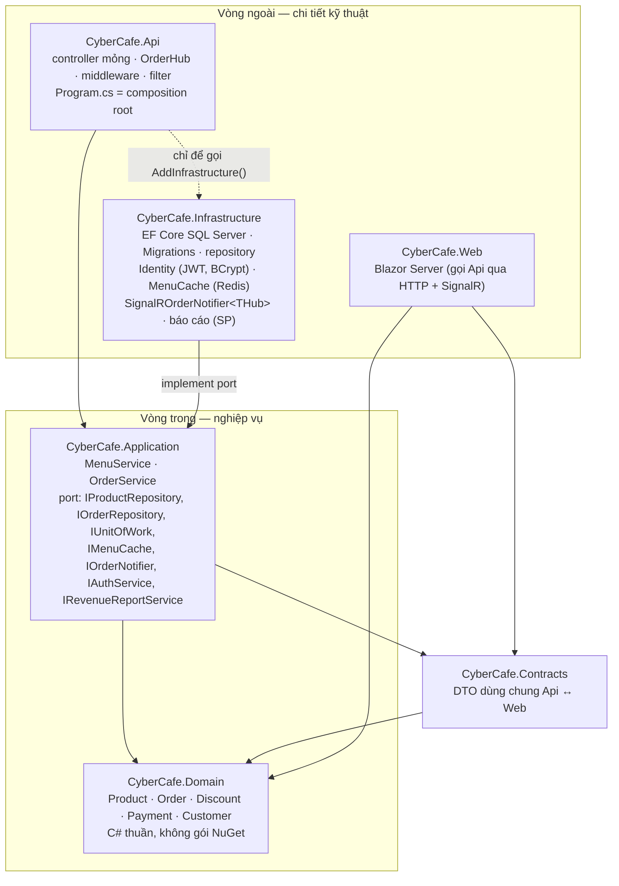
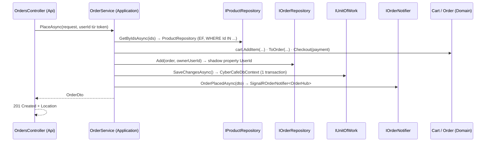

# Kiến trúc CyberCafe (từ tag `b48-clean-arch`)

CyberCafe theo **Clean Architecture**: nghiệp vụ ở giữa, hạ tầng ở ngoài, mũi tên phụ thuộc **chỉ hướng vào trong**.
Quyết định chi tiết: [ADR 0002](adr/0002-clean-architecture-port-hep.md). Kịch bản giảng: [docs/sessions/b48.md](sessions/b48.md).

## Sơ đồ tầng



| Project | Chứa | Được tham chiếu | **Không** được tham chiếu |
|---------|------|-----------------|---------------------------|
| `CyberCafe.Domain` | Entity, luật nghiệp vụ (`OrderStatusFlow`, giá theo size, giảm giá đa hình) | — (chỉ BCL `System.*`) | Mọi thứ khác |
| `CyberCafe.Contracts` | `ProductDto`, `OrderDto`, `PlaceOrderRequest`, `Roles`, tên sự kiện SignalR | Domain (enum) | EF Core, ASP.NET Core |
| `CyberCafe.Application` | Use case (`MenuService`, `OrderService`), port (interface), mapping Domain → DTO, exception nghiệp vụ, `CurrentUser` | Domain, Contracts, `Microsoft.Extensions.DependencyInjection.Abstractions` | EF Core, ASP.NET Core, Redis, BCrypt, Infrastructure, Api |
| `CyberCafe.Infrastructure` | `CyberCafeDbContext` (+ `IUnitOfWork`), Configurations, **Migrations**, repository, Identity, cache, SignalR adapter, báo cáo | Application (và Domain/Contracts qua đó), EF Core, BCrypt, Redis, ASP.NET Core shared framework | Api |
| `CyberCafe.Api` | Controller, `OrderHub`, middleware, filter, policy, exception handler, `Program.cs` | Application, Infrastructure (composition root) | — |
| `CyberCafe.Web` | Blazor Server UI | Contracts, Domain | Api, Application, Infrastructure (chỉ nói chuyện qua HTTP) |

Các luật trên được **kiểm tra tự động** trong `tests/CyberCafe.ArchitectureTests` (Reflection, không thêm gói).

## Một request đi qua các tầng: `POST /api/orders`



Lỗi đi ngược lên bằng exception, **chỉ** `DomainExceptionHandler` (Api) biết mã HTTP:

| Ném ở | Exception | HTTP |
|-------|-----------|------|
| Application | `ValidationException` (món không tồn tại, mã giảm giá sai, đổi loại món) | 400 ValidationProblem |
| Application | `NotFoundException` (không có / không phải của bạn) | 404 |
| Application | `ConflictException` (món đã bán, khách hủy đơn đang pha, email trùng) | 409 |
| Infrastructure (Identity) | `AuthenticationFailedException` | 401 |
| Domain | `ArgumentException` / `InvalidOperationException` | 400 / 409 |

## Đặt code mới ở đâu?

| Bạn cần… | Đặt ở | Ví dụ |
|----------|-------|-------|
| Luật nghiệp vụ không phụ thuộc gì | Domain | "Ready rồi thì không hủy được" |
| Điều phối 1 use case (tra cứu, gọi domain, lưu, báo) | Application service | `OrderService.PlaceAsync` |
| Truy cập dữ liệu / dịch vụ ngoài | Interface ở Application **+** cài đặt ở Infrastructure | `IOrderRepository` ← `OrderRepository` |
| Chi tiết HTTP (route, policy, header, mã trạng thái) | Api | `ProductsController`, `[InvalidateMenuCache]` |
| DTO dùng chung với Web | Contracts | `OrderDto` |

## Lệnh EF Core (từ `b48`)

DbContext và migration nằm ở **Infrastructure**, cấu hình (connection string) đọc từ **Api** → luôn truyền cả 2:

```bash
dotnet ef database update -p src/CyberCafe.Infrastructure -s src/CyberCafe.Api
dotnet ef migrations add <Ten> -p src/CyberCafe.Infrastructure -s src/CyberCafe.Api -o Persistence/Migrations
```

Id các migration cũ giữ nguyên khi chuyển project → database tạo từ `b40`/`b47` dùng tiếp, không cần migration mới.
