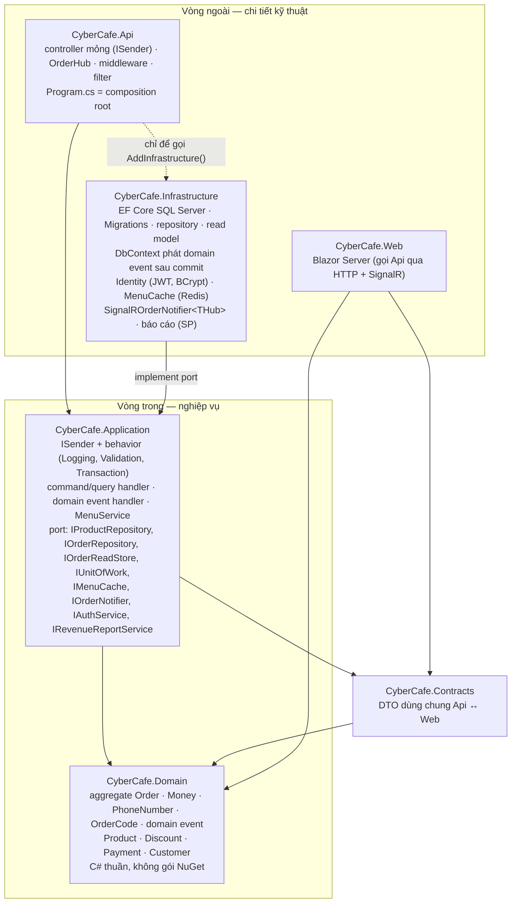
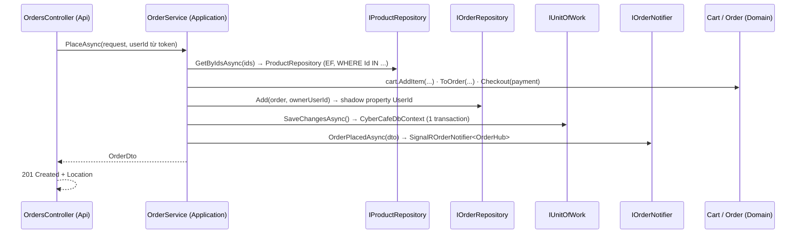
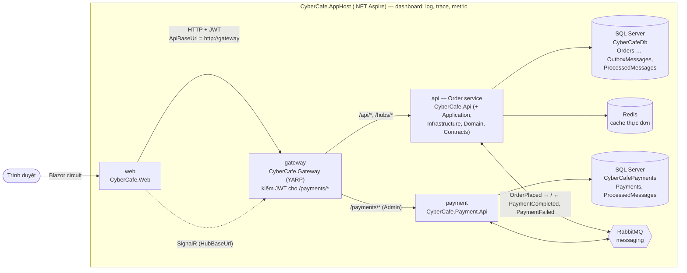
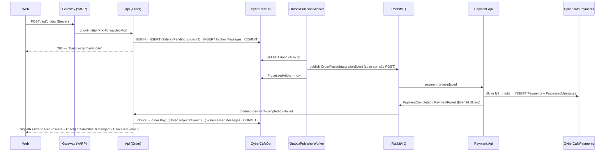

# Kiến trúc CyberCafe (từ tag `b48-clean-arch`, cập nhật `b53-ddd-cqrs`, `b55-microservice`)

CyberCafe theo **Clean Architecture**: nghiệp vụ ở giữa, hạ tầng ở ngoài, mũi tên phụ thuộc **chỉ hướng vào trong**.
Từ `b53`, luồng đơn hàng theo **DDD** (aggregate `Order`, value object, domain event) + **CQRS** (command/query qua dispatcher tự viết).
Từ `b55`, hệ thống chạy thành **nhiều service** điều phối bằng **.NET Aspire** — xem [phần Microservice](#từ-b55-microservice--aspire-gateway-rabbitmq) ở cuối trang; mọi thứ bên trong Order service (Api) vẫn đúng như các sơ đồ dưới đây.
Quyết định chi tiết: [ADR 0002](adr/0002-clean-architecture-port-hep.md), [ADR 0003](adr/0003-cqrs-dispatcher-tu-viet.md), [ADR 0004](adr/0004-rabbitmq-masstransit-v8.md), [ADR 0005](adr/0005-outbox-idempotent-consumer.md). Kịch bản giảng: [b48](sessions/b48.md), [b49](sessions/b49.md) … [b53](sessions/b53.md), [b54](sessions/b54.md), [b55](sessions/b55.md).

## Sơ đồ tầng



| Project | Chứa | Được tham chiếu | **Không** được tham chiếu |
|---------|------|-----------------|---------------------------|
| `CyberCafe.Domain` | Aggregate `Order` (invariant, domain event), value object (`Money`, `PhoneNumber`, `OrderCode`), entity, luật nghiệp vụ (`OrderStatusFlow`, giá theo size, giảm giá đa hình) | — (chỉ BCL `System.*`) | Mọi thứ khác |
| `CyberCafe.Contracts` | `ProductDto`, `OrderDto`, `PlaceOrderRequest`, `Roles`, tên sự kiện SignalR | Domain (enum) | EF Core, ASP.NET Core |
| `CyberCafe.Application` | Use case: command/query + handler (b53), `MenuService`; dispatcher `ISender`, pipeline behavior, domain event publisher; port (interface), mapping Domain → DTO, exception nghiệp vụ, `CurrentUser` | Domain, Contracts, `Microsoft.Extensions.*.Abstractions`, FluentValidation | EF Core, ASP.NET Core, Redis, BCrypt, Infrastructure, Api |
| `CyberCafe.Infrastructure` | `CyberCafeDbContext` (+ `IUnitOfWork`, phát domain event sau commit), Configurations (value converter `Money`), **Migrations**, repository (ghi), `OrderReadStore` (đọc), Identity, cache, SignalR adapter, báo cáo | Application (và Domain/Contracts qua đó), EF Core, BCrypt, Redis, ASP.NET Core shared framework | Api |
| `CyberCafe.Api` | Controller, `OrderHub`, middleware, filter, policy, exception handler, `Program.cs` | Application, Infrastructure (composition root) | — |
| `CyberCafe.Web` | Blazor Server UI | Contracts, Domain | Api, Application, Infrastructure (chỉ nói chuyện qua HTTP) |

Các luật trên được **kiểm tra tự động** trong `tests/CyberCafe.ArchitectureTests` (Reflection, không thêm gói): `LayerDependencyTests` (ai tham chiếu ai) và `DddCqrsRulesTests` (aggregate không setter public, VO/event/command bất biến, mỗi request đúng 1 handler).

## Một request đi qua các tầng: `POST /api/orders` (b48)



Lỗi đi ngược lên bằng exception, **chỉ** `DomainExceptionHandler` (Api) biết mã HTTP:

| Ném ở | Exception | HTTP |
|-------|-----------|------|
| Application | `ValidationException` (món không tồn tại, mã giảm giá sai, đổi loại món) | 400 ValidationProblem |
| Application | `NotFoundException` (không có / không phải của bạn) | 404 |
| Application | `ConflictException` (món đã bán, khách hủy đơn đang pha, email trùng) | 409 |
| Infrastructure (Identity) | `AuthenticationFailedException` | 401 |
| Domain | `ArgumentException` / `InvalidOperationException` | 400 / 409 |

## Từ `b53`: `POST /api/orders` qua CQRS + domain event

```mermaid
sequenceDiagram
    participant C as OrdersController
    participant S as ISender (Sender)
    participant L as LoggingBehavior
    participant V as ValidationBehavior
    participant T as TransactionBehavior
    participant H as PlaceOrderCommandHandler
    participant O as Order (aggregate)
    participant DB as CyberCafeDbContext
    participant E as NotifyBaristasOnOrderPlaced
    C->>S: Send(PlaceOrderCommand.From(request, userId))
    S->>L: →
    L->>V: next
    V->>V: PlaceOrderCommandValidator (FluentValidation) — sai → 400
    V->>T: next
    T->>DB: BeginTransaction (SQL Server; InMemory bỏ qua)
    T->>H: next
    H->>O: Order.Create · AddItem · ApplyDiscount · Pay → Raise(OrderPaid, OrderPlaced)
    H->>DB: Add(order) · SaveChangesAsync → giữ event (đang trong transaction)
    T->>DB: Commit → phát event đang chờ
    DB->>E: OrderPlaced → IOrderNotifier → SignalR group "baristas"
    H-->>C: OrderDto → 201 Created
```

| | GHI (command) | ĐỌC (query) |
|-|---------------|-------------|
| Gửi từ | `OrdersController` (POST/PUT) | `OrdersController` (GET), `ProductsController` (GET), `OrderHub.WatchOrder` |
| Use case | `PlaceOrderCommand`, `ChangeOrderStatusCommand`, `CancelOrderCommand` | `GetOrderByIdQuery`, `GetMyOrdersQuery`, `GetBaristaBoardQuery`, `GetMenuQuery`, `GetProductByIdQuery` |
| Port | `IOrderRepository` (nguyên aggregate, tracked) + `IUnitOfWork` | `IOrderReadStore` (projection → DTO, `AsNoTracking`), `IProductRepository` + `IMenuCache` |
| Luật | Aggregate `Order` (invariant) → `DomainException` 409 | IDOR trong `WHERE` |
| Transaction | Có (`TransactionBehavior`) | Không |

## Đặt code mới ở đâu?

| Bạn cần… | Đặt ở | Ví dụ |
|----------|-------|-------|
| Luật nghiệp vụ không phụ thuộc gì | Domain (method của aggregate) | "Ready rồi thì không hủy được" → `Order.Cancel` |
| Giá trị có luật riêng, so theo giá trị | Domain value object | `Money`, `PhoneNumber` |
| "Sau khi X xảy ra thì làm Y" | Domain event + handler ở Application | `OrderPlaced` → `NotifyBaristasOnOrderPlaced` |
| 1 use case ghi / đọc | Command / query + handler (+ validator) ở Application | `PlaceOrder.cs`, `OrderQueries.cs` |
| Việc cắt ngang mọi use case | Pipeline behavior | `LoggingBehavior` |
| Truy cập dữ liệu / dịch vụ ngoài | Interface ở Application **+** cài đặt ở Infrastructure | `IOrderRepository` ← `OrderRepository` |
| Chi tiết HTTP (route, policy, header, mã trạng thái) | Api | `ProductsController`, `[InvalidateMenuCache]` |
| DTO dùng chung với Web | Contracts | `OrderDto` |

## Lệnh EF Core (từ `b48`)

DbContext và migration nằm ở **Infrastructure**, cấu hình (connection string) đọc từ **Api** → luôn truyền cả 2:

```bash
dotnet ef database update -p src/CyberCafe.Infrastructure -s src/CyberCafe.Api
dotnet ef migrations add <Ten> -p src/CyberCafe.Infrastructure -s src/CyberCafe.Api -o Persistence/Migrations
```

Id các migration cũ giữ nguyên khi chuyển project → database tạo từ `b40`/`b47` dùng tiếp, không cần migration mới.

---

## Từ `b55`: microservice — Aspire, gateway, RabbitMQ

`CyberCafe.Api` không bị viết lại: nó trở thành **Order service** (kèm Menu + Identity — tách tiếp là bài tập). Thanh toán tách ra **Payment service**. Mọi thứ chạy bằng 1 lệnh `dotnet run --project src/CyberCafe.AppHost`.

### Sơ đồ topology



| Project | Vai trò | Tham chiếu được | **Không** tham chiếu |
|---------|---------|-----------------|----------------------|
| `CyberCafe.AppHost` | Khai báo container (SQL, Redis, RabbitMQ) + 4 project, nối cấu hình, dashboard | các project service (chỉ để chạy) | — |
| `CyberCafe.ServiceDefaults` | `AddServiceDefaults()`: OpenTelemetry, health `/health` `/alive`, service discovery, `AddStandardResilienceHandler` | gói Microsoft/OpenTelemetry | Mọi project `CyberCafe.*` |
| `CyberCafe.IntegrationEvents` | Hợp đồng message giữa service (record, kiểu nguyên thủy) | chỉ BCL | Domain, Contracts, MassTransit |
| `CyberCafe.Gateway` | YARP: route `/api`, `/hubs` → api; `/payments` → payment (JWT Admin) | ServiceDefaults | Code của mọi service |
| `CyberCafe.Payment.Api` | Minimal API + consumer `OrderPlaced`, luật thanh toán, DB riêng | IntegrationEvents, ServiceDefaults | Domain, Contracts, Application, Infrastructure, Api |
| `CyberCafe.Api` (+ 4 tầng) | Order/Menu/Identity như b53 + outbox, inbox, consumer kết quả thanh toán | như b53 + IntegrationEvents, ServiceDefaults | Payment.Api |

Luật trên được kiểm tra bởi `tests/CyberCafe.ArchitectureTests/ServiceBoundaryTests.cs`.

### Luồng đặt hàng + thanh toán (trace xuyên service)



Trên Aspire dashboard (tab **Traces**), 1 lần đặt hàng là **1 trace** gồm span của `gateway`, `api` (HTTP, `outbox publish …`, MassTransit `send`/`receive`), `payment` (MassTransit `receive`/`process`/`send`) và quay lại `api`.

### Domain event vs integration event

| | Domain event (b50) | Integration event (b55) |
|-|--------------------|-------------------------|
| Ví dụ | `OrderPaid`, `OrderPlaced`, `OrderStatusChanged` | `OrderPlacedIntegrationEvent`, `PaymentCompletedIntegrationEvent`, `PaymentFailedIntegrationEvent` |
| Phạm vi | Trong Order service, cùng tiến trình | Giữa các service, qua RabbitMQ |
| Nội dung | Tham chiếu aggregate `Order` | Kiểu nguyên thủy, JSON, có `EventId` |
| Phát khi | Sau commit (`CyberCafeDbContext`), best-effort | Ghi Outbox CÙNG transaction → worker gửi (at-least-once) |
| Bên nhận | `IDomainEventHandler<T>` (SignalR, log) | Consumer MassTransit → command (idempotent qua `ProcessedMessages`) |
| Đổi được không | Thoải mái (nội bộ) | Hợp đồng công khai: chỉ thêm field, không đổi/xóa |

### `PaymentFlow`: 2 chế độ thanh toán

| `Payments:Flow` | Ai dùng | `POST /api/orders` |
|-----------------|---------|--------------------|
| `InProcess` (mặc định) | Chạy Api lẻ kiểu b40–b53, toàn bộ test cũ | `order.Pay(...)` ngay, như b53 |
| `Messaging` | AppHost (`Payments__Flow=Messaging`), `PaymentMessagingTests` | Lưu đơn chờ + outbox; kết quả đến sau qua RabbitMQ |

### Đặt code mới ở đâu? (bổ sung b55)

| Bạn cần… | Đặt ở | Ví dụ |
|----------|-------|-------|
| Báo cho service KHÁC biết điều gì đã xảy ra | Record trong `CyberCafe.IntegrationEvents` + `IIntegrationEventOutbox.Enqueue` trong command handler | `OrderPlacedIntegrationEvent` |
| Nhận message từ service khác | Consumer mỏng ở Infrastructure/Messaging → command ở Application (kiểm `IInbox`) | `PaymentCompletedConsumer` → `ConfirmOrderPaymentCommand` |
| Route mới cho client | `ReverseProxy` trong `src/CyberCafe.Gateway/appsettings.json` | `/payments/{**catch-all}` |
| Container / service mới | `src/CyberCafe.AppHost/AppHost.cs` (`AddXxx` + `WithReference` + `WaitFor`) | `AddRabbitMQ("messaging")` |
| Log/trace/health/resilience dùng chung | `src/CyberCafe.ServiceDefaults/Extensions.cs` | `AddSource("CyberCafe.*")` |

Lệnh EF cho Payment service (project = startup = chính nó):

```bash
dotnet ef migrations add <Ten> -p src/CyberCafe.Payment.Api -s src/CyberCafe.Payment.Api -o Data/Migrations
```

