# Buổi 23 — Blazor Server buổi 1: Khởi tạo CyberCafe.Web

> **Thời lượng:** 120–150 phút
> **Tag kết quả:** `b23-blazor-start`
> **Tag xuất phát:** (repo trống)
> **Code convention:** định danh tiếng Anh; giao diện + giảng miệng tiếng Việt

---

## Chuẩn bị trước giờ học

| Hạng mục | Chi tiết |
|----------|----------|
| SDK | `dotnet --version` → 10.0.x trên máy giảng viên **và** nhắc học viên cài trước |
| Demo sản phẩm cuối | Checkout `b28-cart-state`, chạy sẵn 1 terminal để show 3 phút đầu |
| Repo trống | Thư mục `cybercafe` mới để live-code từ đầu |
| Tool | VS 2022 / Rider / VS Code + C# Dev Kit; trình duyệt mở DevTools (tab Network → WS) |
| Không dạy buổi này | Component con, `[Parameter]`, binding 2 chiều, form — để buổi 24–28 |

---

## Mục tiêu buổi học

Cuối buổi, học viên:

1. Giải thích được Blazor Server chạy thế nào (render trên server, cập nhật UI qua SignalR circuit).
2. Tạo được Blazor Web App với render mode **Interactive Server**, hiểu cấu trúc thư mục.
3. Thêm trang mới bằng `@page`, gắn vào NavMenu, hiểu `MainLayout` + `@Body`.
4. Dùng cú pháp Razor: `@biểu_thức`, `@if`, `@foreach`, `@code`.
5. Đăng ký service vào DI và `@inject` vào component.
6. Viết unit test đầu tiên cho service.

---

## Tổng quan luồng buổi học

```mermaid
flowchart LR
    A[Demo sản phẩm cuối] --> B[Blazor là gì]
    B --> C[Tạo solution + project]
    C --> D[Tour cấu trúc]
    D --> E[Layout + NavMenu]
    E --> F[Razor syntax: Home]
    F --> G[MenuService + DI]
    G --> H[Trang Menu @foreach]
    H --> I[Unit test]
    I --> J[Commit + tag]
    J --> K[Exit ticket]
```



---

## Bước 0 — Mở đầu (10 phút)

### Giảng viên nói
> "Từ hôm nay đến cuối khóa, cả lớp cùng xây **một** app: CyberCafe — quán cà phê đặt món online. Domain chính là những class `Coffee`, `Tea`, `Order`, `Payment` các bạn đã viết ở phần OOP. Mỗi buổi thêm một tầng: hôm nay là giao diện Blazor, sau đó API, database, bảo mật, rồi microservice."

### Hành động
1. Chạy bản `b28-cart-state`: thêm món vào giỏ, đặt hàng.
2. Mở DevTools → Network → WS: chỉ cho học viên thấy kết nối `_blazor` (SignalR). Click nút → thấy message nhỏ bay qua lại.
3. Giới thiệu cách dùng tag: `git tag -l -n1`, `git checkout b23-blazor-start` (xem README).

### Check
*"Khi bấm nút trên trang Blazor Server, code C# chạy ở đâu?"* → Trên **server**; trình duyệt chỉ nhận phần DOM thay đổi.

---

## Bước 1 — Tạo solution (15 phút)

```bash
mkdir cybercafe && cd cybercafe
git init -b main
dotnet new globaljson --sdk-version 10.0.100 --roll-forward latestFeature
dotnet new gitignore
dotnet new editorconfig
dotnet new sln -n CyberCafe --format slnx

dotnet new blazor -n CyberCafe.Web -o src/CyberCafe.Web --interactivity Server --all-interactive
dotnet new xunit  -n CyberCafe.Tests -o tests/CyberCafe.Tests

dotnet sln add src/CyberCafe.Web --solution-folder src
dotnet sln add tests/CyberCafe.Tests --solution-folder tests
dotnet add tests/CyberCafe.Tests reference src/CyberCafe.Web
```

Tạo `Directory.Build.props` ở gốc (giải thích: thiết lập 1 lần cho mọi project):

```xml
<Project>
  <PropertyGroup>
    <Nullable>enable</Nullable>
    <ImplicitUsings>enable</ImplicitUsings>
  </PropertyGroup>
</Project>
```

### Giảng viên nói
> "`--interactivity Server --all-interactive` nghĩa là **toàn bộ app** chạy Interactive Server: mọi trang đều nhận được sự kiện click. Blazor còn có Static SSR, WebAssembly, Auto — mình sẽ so sánh khi cần."

### Check
*"`global.json` dùng để làm gì?"* → Cố định phiên bản SDK cho cả lớp, tránh "máy em build được, máy bạn không".

---

## Bước 2 — Tour cấu trúc project (10 phút)

Mở lần lượt và giải thích 1 câu cho mỗi file:

| File | Vai trò |
|------|---------|
| `Program.cs` | Đăng ký service (`AddRazorComponents().AddInteractiveServerComponents()`), pipeline, `MapRazorComponents<App>()` |
| `Components/App.razor` | Trang HTML gốc; `<Routes @rendermode="InteractiveServer" />` |
| `Components/Routes.razor` | `Router` tìm component có `@page` khớp URL |
| `Components/Layout/MainLayout.razor` | Khung trang; `@Body` = chỗ trang con hiện ra |
| `Components/_Imports.razor` | `@using` dùng chung cho mọi `.razor` |
| `wwwroot/` | File tĩnh: Bootstrap, css, favicon |

Xóa `Counter.razor`, `Weather.razor` (sẽ tự viết trang của mình).

---

## Bước 3 — Layout + NavMenu (15 phút)

1. Sửa `NavMenu.razor`: brand `☕ CyberCafe`, 3 link: **Trang chủ** (`href=""`, `Match="NavLinkMatch.All"`), **Thực đơn** (`menu`), **Giới thiệu** (`about`).
2. Sửa `MainLayout.razor`: thông báo lỗi tiếng Việt.
3. `App.razor`: `<html lang="vi">`.

### Giảng viên nói
> "`NavLink` khác `<a>` ở chỗ nó tự thêm class `active` khi URL khớp. `NavLinkMatch.All` cho trang chủ, nếu không thì mọi URL đều 'khớp' với `/`."

### Check
Hỏi: *"Bỏ `Match="NavLinkMatch.All"` thì chuyện gì xảy ra?"* → Link Trang chủ luôn sáng.

---

## Bước 4 — Razor syntax trên trang Home (15 phút)

```razor
@page "/"

<PageTitle>CyberCafe — Trang chủ</PageTitle>

<h1>Chào mừng đến CyberCafe ☕</h1>
<p>Hôm nay là <strong>@DateTime.Now.ToString("dd/MM/yyyy")</strong>.</p>

@if (DateTime.Now.Hour < 11)
{
    <div class="alert alert-success">🌅 Khung giờ sáng: giảm 10% cho cà phê!</div>
}
else
{
    <div class="alert alert-info">Mở cửa 7:00 – 22:00 mỗi ngày.</div>
}
```

Trang About: giới thiệu khối `@code` + `@foreach` trên mảng `_techs`.

### Analogies
| Razor | Giống với |
|-------|-----------|
| `@biến` | `Console.Write(biến)` nhưng in ra HTML |
| `@if / @foreach` | `if / foreach` C# — bên trong viết HTML |
| `@code { }` | Phần thân class C# của component |
| `@page "/about"` | "Địa chỉ nhà" của component |

### Check
*"`@page` thiếu thì sao?"* → Component vẫn tồn tại nhưng không truy cập được bằng URL (chỉ dùng làm component con).

---

## Bước 5 — `MenuService` + Dependency Injection (20 phút)

1. Tạo `Models/MenuItem.cs` (model tạm — buổi 28 thay bằng domain OOP): `Id, Name, Category, Price, Description, Emoji, IsAvailable`.
2. Tạo `Services/MenuService.cs` với list seed 8 món (3 cà phê, 3 trà, 2 bánh; 1 món `IsAvailable = false`) và các method `GetAll`, `GetCategories`, `GetByCategory`, `GetById`.
3. Đăng ký trong `Program.cs`:

```csharp
builder.Services.AddSingleton<MenuService>();
```

### Giảng viên nói
> "Component không `new MenuService()` — nó **xin** DI cấp bằng `@inject`. Lợi ích: đổi nguồn dữ liệu (API ở buổi 32, database buổi 41) mà trang Menu gần như không đổi. Singleton vì menu dùng chung cho mọi người."

Bảng lifetime (giới thiệu nhanh, dùng thật ở buổi 28):

| Lifetime | Blazor Server | Ví dụ CyberCafe |
|----------|---------------|-----------------|
| Singleton | 1 instance cho cả app | Menu, kho đơn hàng |
| Scoped | 1 instance / circuit (1 tab) | Giỏ hàng (buổi 28) |
| Transient | Mỗi lần inject 1 instance mới | Helper không trạng thái |

---

## Bước 6 — Trang Menu (20 phút)

```razor
@page "/menu"
@inject MenuService MenuService

<h1>Thực đơn</h1>

@foreach (string category in MenuService.GetCategories())
{
    <h3 class="mt-4">@category</h3>
    <div class="row row-cols-1 row-cols-md-2 row-cols-lg-4 g-3">
        @foreach (MenuItem item in MenuService.GetByCategory(category))
        {
            <div class="col">
                <div class="card h-100 @(item.IsAvailable ? "" : "opacity-50")">
                    <div class="card-body">
                        <div class="fs-1">@item.Emoji</div>
                        <h5 class="card-title">@item.Name</h5>
                        <p class="fw-bold">@item.Price.ToString("N0") đ</p>
                    </div>
                    <div class="card-footer bg-transparent">
                        @if (item.IsAvailable) { <span class="badge bg-success">Còn hàng</span> }
                        else { <span class="badge bg-secondary">Tạm hết</span> }
                    </div>
                </div>
            </div>
        }
    </div>
}
```

Nhấn mạnh: `@(...)` cho biểu thức phức tạp trong attribute; `ToString("N0")` định dạng tiền.

### Check
Live poll: *"Muốn chỉ hiện món còn hàng, sửa chỗ nào?"* → `.Where(x => x.IsAvailable)` hoặc `@if` bọc card.

---

## Bước 7 — Unit test (10 phút)

`tests/CyberCafe.Tests/MenuServiceTests.cs`: `GetAll` không rỗng, `GetCategories` có đủ 3 nhóm, `[Theory]` `GetByCategory` chỉ trả đúng nhóm, `GetById` id lạ → `null`, mọi giá > 0.

```bash
dotnet build
dotnet test     # 6 test xanh
```

---

## Bước 8 — Commit + tag (5 phút)

```bash
git add -A
git commit -m "b23: Blazor Server skeleton with menu"
git tag -a b23-blazor-start -m "Buổi 23: Blazor Server khởi đầu — layout, routing, menu in-memory"
git log --oneline --decorate
```

---

## Lab cho học viên (về nhà)

1. Thêm trang `/contact` (địa chỉ quán, giờ mở cửa) + link trên NavMenu.
2. Trang Menu: hiện số món trong mỗi nhóm cạnh tiêu đề (`Cà phê (3)`).
3. Thêm 1 test: `GetByCategory("Không tồn tại")` trả list rỗng.

---

## Exit ticket (5 phút)

1. Blazor Server cập nhật giao diện trên trình duyệt bằng kênh gì?
2. Khác nhau giữa `<a href>` và `<NavLink>`?
3. `@inject MenuService MenuService` — vế trái và vế phải là gì?
4. Vì sao `MenuService` đăng ký Singleton mà không phải Scoped?
5. Viết đoạn Razor in danh sách tên món còn hàng dạng `<ul><li>`.

**Đáp án gợi ý:** (1) SignalR (WebSocket) circuit. (2) NavLink tự gắn class `active`. (3) Kiểu service / tên property trong component. (4) Dữ liệu menu dùng chung, không phụ thuộc người dùng. (5) `@foreach (var x in MenuService.GetAll().Where(i => i.IsAvailable)) { <li>@x.Name</li> }` trong `<ul>`.

---

## Câu hỏi thường gặp

| Câu hỏi | Trả lời |
|---------|---------|
| Blazor Server khác MVC/Razor Pages? | MVC render HTML 1 lần mỗi request; Blazor Server giữ kết nối, component có trạng thái, sự kiện xử lý trên server. |
| Mất mạng thì sao? | Hiện `ReconnectModal`; mất circuit = mất state trong bộ nhớ. |
| Vì sao chưa dùng database? | Tập trung UI trước; database ở buổi 36–41 (`b41-efcore`). |

---

## Checklist giảng viên cuối buổi

- [ ] Học viên chạy được app, thấy 3 trang
- [ ] ≥ 70% tự thêm được 1 trang mới + link NavMenu
- [ ] Đã giải thích DI + lifetime ở mức cơ bản
- [ ] `dotnet test` xanh trên máy học viên
- [ ] Nhắc: buổi sau tách component `ProductCard`, binding
