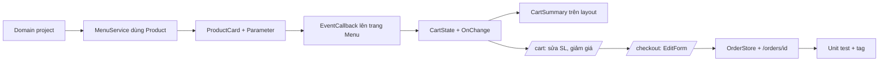

# Buổi 24–28 (→31) — Component, binding, state giỏ hàng, form đặt hàng

> **Thời lượng:** nhiều buổi (gợi ý chia bên dưới), mỗi buổi 120–150 phút
> **Tag xuất phát:** `b23-blazor-start`
> **Tag kết quả:** `b28-cart-state`
> **Xem thay đổi:** `git diff b23-blazor-start b28-cart-state --stat`

---

## Chuẩn bị trước giờ học

| Hạng mục | Chi tiết |
|----------|----------|
| Code | `git switch -c live-b24 b23-blazor-start` trên máy giảng viên |
| Domain cũ | Mở song song `day-04/CoffeeShopManagement/Models` để đối chiếu khi port |
| Bản đích | Checkout `b28-cart-state` ở thư mục khác để copy nhanh khi trễ giờ |
| Mã giảm giá demo | `GIAM20K` (voucher -20.000đ), `MEMBER10` (thành viên -10%) |
| Không dạy | Gọi API, database, đăng nhập — để buổi 32+ |

### Gợi ý chia buổi

| Buổi | Nội dung | Bước |
|------|----------|------|
| 24 | Port domain OOP sang `CyberCafe.Domain`, `MenuService` dùng `Product` | 1–2 |
| 25 | Component con: `ProductCard`, `[Parameter]`, `EventCallback` | 3 |
| 26 | Data binding: one-way, `@bind`, `@bind:event`, `@bind:after` | 3–4 |
| 27 | State dùng chung: `CartState`, event `OnChange`, `IDisposable`; lifecycle | 5–6 |
| 28 | Trang giỏ hàng + giảm giá (đa hình) | 7 |
| 29–31 | Form: `EditForm`, validation, checkout, trang xác nhận, test, ôn tập | 8–10 |

---

## Mục tiêu

Cuối chuỗi buổi, học viên:

1. Tách domain C# thuần thành project riêng và dùng lại hierarchy OOP đã học.
2. Viết component nhận dữ liệu bằng `[Parameter]` và báo sự kiện bằng `EventCallback<T>`.
3. Phân biệt one-way binding, two-way `@bind`, `@bind:event="oninput"`, `@bind:after`.
4. Chia sẻ state giữa component bằng service **Scoped** + event, biết unsubscribe để tránh leak.
5. Nắm thứ tự lifecycle: `OnInitialized(Async)` → `OnParametersSet` → render → `OnAfterRender(firstRender)` → `Dispose`.
6. Làm form với `EditForm` + `DataAnnotationsValidator` + `IValidatableObject`.

---

## Tổng quan luồng



---

## Bước 1 — Tạo `CyberCafe.Domain` (buổi 24, 40 phút)

```bash
dotnet new classlib -n CyberCafe.Domain -o src/CyberCafe.Domain
dotnet sln add src/CyberCafe.Domain --solution-folder src
dotnet add src/CyberCafe.Web reference src/CyberCafe.Domain
dotnet add tests/CyberCafe.Tests reference src/CyberCafe.Domain
```

Port từ `day-04/CoffeeShopManagement/Models`, giữ nguyên tư tưởng OOP, **3 thay đổi có chủ đích** (giải thích từng cái):

| day-04 | CyberCafe.Domain | Lý do |
|--------|------------------|-------|
| `Coffee.Size` (string) | `DrinkSize` enum trên `OrderItem` | 1 món trên menu bán nhiều size → size thuộc về **dòng đơn** |
| `Product → Coffee/Tea/Cake` | `Product → Drink (abstract) → Coffee/Tea`; `Cake : Product` | Gom logic phụ thu size (M +5k, L +10k) vào `Drink.GetPrice(size)` |
| `throw new Exception(...)` | `ArgumentException` / `InvalidOperationException` | Bắt lỗi chính xác hơn ở UI (`catch ... when`) |

Thêm `Cart` (giỏ hàng — C# thuần, không biết Blazor): `AddItem` (cùng món + cùng size → cộng dồn), `UpdateQuantity` (≤ 0 → xóa), `RemoveItem`, `ApplyDiscount`, `Subtotal`, `DiscountAmount`, `Total`, `ToOrder(customer, note)`.

### Check
*"Vì sao `Cart` không nằm trong project Web?"* → Domain không phụ thuộc UI; test được bằng xUnit thuần; buổi 32 API dùng lại.

---

## Bước 2 — `MenuService` trả `Product` (buổi 24, 15 phút)

- Xóa `Models/MenuItem.cs` (model tạm của b23). Seed bằng `new Coffee(...)`, `new Tea(...)`, `new Cake(...)`.
- Thêm `GetMenuAsync()` có `Task.Delay(400)` để giả lập mạng (phục vụ demo lifecycle).
- Trang Menu: `product.Category` giờ là **property virtual** override ở từng class con → đa hình ngay trên UI.

---

## Bước 3 — Component `ProductCard` (buổi 25–26, 45 phút)

`Components/Shared/ProductCard.razor`:

```razor
@code {
    [Parameter, EditorRequired] public Product Product { get; set; } = default!;
    [Parameter] public EventCallback<AddToCartArgs> OnAddToCart { get; set; }

    private DrinkSize _size = DrinkSize.S;
    private int _quantity = 1;
    private decimal CurrentPrice => Product.GetPrice(_size) * _quantity;   // one-way

    private async Task AddToCartAsync()
        => await OnAddToCart.InvokeAsync(new AddToCartArgs(Product, _size, _quantity));
}
```

Markup: `@if (Product.HasSize)` mới hiện `<select @bind="_size">`; `<input type="number" @bind="_quantity" @bind:after="ClampQuantity" />`.

Trang Menu dùng: `<ProductCard Product="product" OnAddToCart="HandleAddToCart" />` + `@key="product.Id"`.

### Giảng viên nói
> "Dữ liệu chảy **xuống** qua Parameter, sự kiện chảy **lên** qua EventCallback. Card không biết giỏ hàng là gì — nó chỉ hét lên 'có người bấm thêm món này'. Trang cha quyết định làm gì."

### Analogies
| Khái niệm | Đời thường |
|-----------|------------|
| `[Parameter]` | Phiếu order quầy đưa cho barista |
| `EventCallback` | Barista bấm chuông báo "xong món" |
| `@key` | Số bàn — Blazor nhận ra đúng card khi danh sách đổi thứ tự |

### Check
*"Sửa `Product.Name` bên trong ProductCard có nên không?"* → Không: Parameter là dữ liệu của cha; con chỉ đọc.

---

## Bước 4 — Binding nâng cao trên trang Menu (buổi 26, 25 phút)

```razor
<input class="form-control" placeholder="Tìm món..." @bind="_keyword" @bind:event="oninput" />
<select class="form-select" @bind="_category"> ... </select>
```

`FilteredProducts` là property tính lại mỗi lần render (lọc theo nhóm + tên).

| Cú pháp | Khi nào cập nhật biến |
|---------|-----------------------|
| `value="@x"` | Không bao giờ (one-way) |
| `@bind="x"` | Khi `onchange` (rời ô / chọn xong) |
| `@bind="x" @bind:event="oninput"` | Mỗi phím gõ |
| `@bind:after="Method"` | Gọi `Method` **sau khi** gán xong |

### Check
Cho học viên đổi `oninput` → bỏ đi, gõ tìm kiếm: *"Khác gì?"* → Chỉ lọc khi rời ô.

---

## Bước 5 — `CartState`: state dùng chung (buổi 27, 40 phút)

```csharp
public class CartState
{
    public Cart Cart { get; } = new();
    public event Action? OnChange;

    public void AddItem(Product p, DrinkSize s, int q) { Cart.AddItem(p, s, q); NotifyStateChanged(); }
    // UpdateQuantity, RemoveItem, ApplyDiscount, ClearDiscount, Clear ... cùng mẫu
    private void NotifyStateChanged() => OnChange?.Invoke();
}
```

```csharp
builder.Services.AddScoped<CartState>();     // 1 giỏ / circuit (1 tab)
builder.Services.AddSingleton<OrderStore>();  // kho đơn chung
```

`CartSummary.razor` (đặt trên top-row của `MainLayout`):

```razor
@implements IDisposable
@inject CartState CartState
...
@code {
    protected override void OnInitialized() => CartState.OnChange += HandleCartChanged;
    private void HandleCartChanged() => InvokeAsync(StateHasChanged);
    public void Dispose() => CartState.OnChange -= HandleCartChanged;
}
```

### Giảng viên nói
> "Thêm món ở trang Menu, badge trên layout phải nhảy số. Hai component không biết nhau — chúng nói chuyện qua `CartState`. Ai quan tâm thì **đăng ký** event; rời đi thì **hủy đăng ký**, không thì service giữ tham chiếu tới component đã chết → rò rỉ bộ nhớ."

### Demo nhanh
1. Mở 2 tab → mỗi tab 1 giỏ riêng (Scoped theo circuit).
2. F5 → giỏ mất (circuit mới). Hỏi: *"Muốn giữ giỏ khi F5 thì làm sao?"* → localStorage / database (buổi sau).
3. Đổi thử `AddSingleton<CartState>` → 2 tab dùng chung 1 giỏ → **bug nghiêm trọng**. Đổi lại.

### Check
*"Bỏ dòng `Dispose` thì app có lỗi ngay không?"* → Không thấy ngay; lỗi âm thầm (leak + gọi `StateHasChanged` trên component đã dispose).

---

## Bước 6 — Lifecycle (buổi 27, 20 phút)

Trong `Menu.razor`:

```csharp
protected override async Task OnInitializedAsync()
    => _products = await MenuService.GetMenuAsync(_cts.Token);   // render lần 1: _products == null → "Đang tải..."

protected override void OnAfterRender(bool firstRender)
{
    if (firstRender) Logger.LogInformation("Menu: first render xong");  // chỗ gọi JS interop
}

public void Dispose() { _cts.Cancel(); _cts.Dispose(); }          // rời trang khi đang tải
```

Trong `OrderConfirmation.razor`: `OnParametersSet` đọc lại đơn khi route parameter `{OrderId}` đổi.

| Hook | Chạy khi | Dùng cho |
|------|----------|----------|
| `OnInitialized(Async)` | 1 lần khi tạo component | Load dữ liệu, subscribe event |
| `OnParametersSet(Async)` | Mỗi lần parameter đổi | Dữ liệu phụ thuộc parameter/route |
| `OnAfterRender(firstRender)` | Sau mỗi lần render | JS interop, focus |
| `Dispose` | Component bị bỏ | Unsubscribe, cancel |

> Lưu ý: với prerender, `OnInitializedAsync` chạy **2 lần** (prerender + khi circuit kết nối). Xem log để học viên thấy; giải pháp (`PersistentComponentState`) chỉ giới thiệu.

---

## Bước 7 — Trang giỏ hàng `/cart` (buổi 28, 40 phút)

- File tên `CartPage.razor` (không đặt `Cart.razor` vì trùng tên class domain `Cart` → lỗi biên dịch khó hiểu — kể cho học viên!).
- Bảng: món, size, đơn giá (`item.UnitPrice` — đa hình qua `GetPrice`), số lượng, thành tiền, nút xóa.
- Ô số lượng dùng `value="@item.Quantity" @onchange="..."` thay vì `@bind` trực tiếp vào domain: setter domain ném exception khi ≤ 0, nên ta chặn và gọi `UpdateQuantity` (≤ 0 → xóa dòng).
- Mã giảm giá: `DiscountService.FindByCode(code)` trả về `Discount` (class cha). Trang chỉ gọi `Discount.Display()` và `Cart.DiscountAmount` — **không có `if` theo loại giảm giá**: đó là đa hình đã học ở day-04.

### Check
*"Thêm loại giảm giá 'Happy hour 15%' thì sửa những file nào?"* → Thêm class mới (hoặc tạo `MemberDiscount` với 15) + 1 dòng trong `DiscountService`. Trang Cart **không đổi**.

---

## Bước 8 — Form đặt hàng `/checkout` (buổi 29–30, 60 phút)

`Models/CheckoutModel.cs`:

```csharp
[Required(ErrorMessage = "Vui lòng nhập họ tên")]
[StringLength(50, MinimumLength = 2, ErrorMessage = "Họ tên từ 2 đến 50 ký tự")]
public string FullName { get; set; } = "";

[Required(ErrorMessage = "Vui lòng nhập số điện thoại")]
[RegularExpression(@"^0\d{9,10}$", ErrorMessage = "Số điện thoại gồm 10–11 chữ số, bắt đầu bằng 0")]
public string PhoneNumber { get; set; } = "";

[Required] public PaymentMethod? PaymentMethod { get; set; } = Domain.Payments.PaymentMethod.Cash;
public string? CardNumber { get; set; }          // bắt buộc khi chọn Thẻ → IValidatableObject
[StringLength(200)] public string? Note { get; set; }
```

`Checkout.razor`: `EditForm Model="_model" OnValidSubmit="PlaceOrder"` + `DataAnnotationsValidator` + `ValidationSummary` + `InputText`, `InputSelect`, `InputTextArea`, `ValidationMessage`. Ô số thẻ chỉ hiện khi `_model.PaymentMethod == PaymentMethod.Card`.

```csharp
private void PlaceOrder()
{
    Customer customer = new(_model.FullName, _model.PhoneNumber);
    Order order = CartState.Cart.ToOrder(customer, _model.Note);
    order.Checkout(_model.CreatePayment(order.FinalAmount));   // Cash/Card/Momo — đa hình
    OrderStore.Add(order);                                     // gán mã CC-0001...
    CartState.Clear();
    Navigation.NavigateTo($"orders/{order.Id}");
}
```

### Giảng viên nói
> "Vì sao có `CheckoutModel` riêng mà không bind thẳng vào `Customer`? Vì domain object **luôn hợp lệ** — setter ném exception ngay. Form thì được phép sai tạm thời trong lúc người dùng gõ. View model là lớp đệm giữa hai thế giới."

### Check
Cho học viên nhập SĐT `12345` → thấy lỗi; chọn Thẻ, bỏ trống số thẻ → thấy lỗi từ `IValidatableObject`.

---

## Bước 9 — Trang xác nhận `/orders/{OrderId}` (buổi 30, 15 phút)

Route parameter `[Parameter] public string OrderId`, `OnParametersSet` → `OrderStore.GetById`. Hiện khách hàng + điểm tích lũy (10.000đ = 1 điểm, logic trong `Order.Checkout`), trạng thái `OrderStatus.Pending` ("Chờ pha chế" — buổi 33–34 barista sẽ đổi realtime), thanh toán `Payment.Display()`.

---

## Bước 10 — Unit test + tag (buổi 31, 30 phút)

| File test | Kiểm tra |
|-----------|----------|
| `Domain/CartTests.cs` | Giá theo size, bánh bỏ qua size, cộng dồn cùng món+size, khác size tách dòng, tổng, sửa SL về 0, món hết hàng, member %, voucher, `ToOrder` sao chép dòng |
| `Domain/DiscountTests.cs` | % hợp lệ, voucher không âm, đa hình trên `List<Discount>` |
| `Domain/OrderAndPaymentTests.cs` | `Checkout` đồng bộ số tiền, cộng điểm, tiền mặt thiếu, thối tiền, che số thẻ, quy tắc SĐT |
| `Web/CartStateAndCheckoutTests.cs` | `OnChange` bắn đúng số lần, mã giảm giá, `OrderStore` sinh mã, validate `CheckoutModel`, tạo đúng loại `Payment` |

```bash
dotnet test        # 51 test xanh
git add -A
git commit -m "b28: components, cart state, checkout form and domain model"
git tag -a b28-cart-state -m "Buổi 24–31: component, binding, CartState, EditForm, domain OOP"
```

---

## Lab cho học viên

1. **Nút +/-** cạnh ô số lượng ở trang giỏ (gọi `CartState.UpdateQuantity`).
2. **`MenuFilter` component**: tách ô tìm kiếm + select nhóm thành component con, dùng two-way binding cho component: `[Parameter] string Keyword` + `[Parameter] EventCallback<string> KeywordChanged` → dùng `<MenuFilter @bind-Keyword="_keyword" />`.
3. **Mã giảm giá mới** `HAPPYHOUR` -15% chỉ áp dụng 14h–17h (gợi ý: class `HappyHourDiscount : MemberDiscount`, override `Apply`). Viết test.
4. (Nâng cao) Lưu giỏ vào `ProtectedLocalStorage` để F5 không mất.

---

## Exit ticket

1. Dữ liệu từ cha xuống con đi bằng gì? Sự kiện từ con lên cha đi bằng gì?
2. `@bind` và `@bind:event="oninput"` khác nhau thế nào?
3. Vì sao `CartState` là Scoped mà không phải Singleton trong Blazor Server?
4. Quên `CartState.OnChange -= ...` trong `Dispose` gây hậu quả gì?
5. `OnInitializedAsync` và `OnAfterRender(firstRender: true)` — cái nào chạy trước, dùng cái nào để gọi JS?
6. Trang Cart tính giảm giá mà không cần biết là voucher hay member — nhờ tính chất OOP nào?

**Đáp án gợi ý:** (1) `[Parameter]` / `EventCallback`. (2) Cập nhật khi `onchange` vs mỗi phím gõ. (3) Singleton = mọi người dùng chung 1 giỏ. (4) Rò rỉ bộ nhớ, gọi render trên component đã hủy. (5) `OnInitializedAsync` trước; JS interop trong `OnAfterRender`. (6) Đa hình (override `Discount.Apply`).

---

## Câu hỏi thường gặp

| Câu hỏi | Trả lời |
|---------|---------|
| Vì sao `InvokeAsync(StateHasChanged)` mà không `StateHasChanged()`? | Event có thể bắn từ luồng/component khác; `InvokeAsync` đưa việc render về đúng dispatcher của component. |
| `EventCallback` khác `Action`? | `EventCallback` tự gọi `StateHasChanged` cho component cha và hỗ trợ async. |
| Sao `OnInitializedAsync` log 2 lần? | Prerender + interactive. Bình thường; buổi sau dùng `PersistentComponentState` nếu cần. |
| Đơn mất khi restart app? | Đúng, `OrderStore` in-memory. Database ở `b41-efcore`. |

---

## Checklist giảng viên cuối chuỗi buổi

- [ ] Học viên giải thích được luồng Parameter ↓ / EventCallback ↑
- [ ] Demo 2 tab = 2 giỏ; đổi Singleton thấy bug
- [ ] ≥ 70% hoàn thành lab 1 + 2
- [ ] `dotnet test` xanh; học viên checkout được `b28-cart-state`
- [ ] Preview buổi 32: tách `CyberCafe.Api`, gọi bằng `HttpClient`
