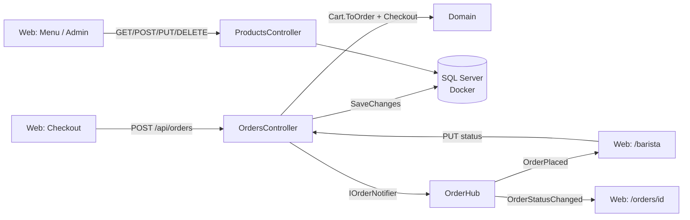

# Buổi 32–41 — Web API, EF Core + SQL Server, SignalR cho quầy barista

> **Thời lượng:** nhiều buổi (gợi ý chia bên dưới), mỗi buổi 120–150 phút
> **Tag xuất phát:** `b28-cart-state`
> **Tag kết quả:** `b40-api-efcore`
> **Xem thay đổi:** `git diff b28-cart-state b40-api-efcore --stat`

---

## Chuẩn bị trước giờ học

| Hạng mục | Chi tiết |
|----------|----------|
| Code | `git switch -c live-b32 b28-cart-state` trên máy giảng viên |
| Lab đã dạy | `dotnet-blazor-lab` tag `b32`, `b33`; `dotnet-webapi-lab` tag `b35` … `b41` — CyberCafe chỉ **áp dụng lại**, không giảng lại từ đầu |
| Docker | Docker Desktop chạy sẵn; `docker pull mcr.microsoft.com/mssql/server:2022-latest` trước giờ học (image ~1,5 GB) |
| Tool | `dotnet tool restore` (dotnet-ef 10.0.12 theo `dotnet-tools.json`); Azure Data Studio / SSMS / extension SQL của VS Code để xem bảng |
| Bản đích | Checkout `b40-api-efcore` ở thư mục khác để copy nhanh khi trễ giờ |
| Cổng | Api `5180`, Web `5170`, SQL Server `1434` (tránh đụng SQL Server của lab ở 1433) |
| Không dạy | Đăng nhập/JWT, cache, middleware tự viết — để chặng 42–47 |

### Gợi ý chia buổi

| Buổi | Nội dung | Bước | Lab tương ứng |
|------|----------|------|---------------|
| 32 | Tách `CyberCafe.Api` + `Contracts`, ProductsController, OpenAPI/Scalar (DbContext tạm dùng **EF InMemory**) | 1–2, 6 (CRUD) | webapi-lab `b35` |
| 33 | Web gọi API: typed HttpClient, trang Menu, trang `/admin/menu` | 10–11 | blazor-lab `b32` |
| 34 | OrdersController + SignalR: `OrderHub`, trang `/barista`, trang xác nhận tự cập nhật | 7, 9, 12 | blazor-lab `b33` |
| 35 | Mã trạng thái REST, test `WebApplicationFactory` | 13 | webapi-lab `b35` |
| 36–37 | SQL Server trong Docker, đọc lược đồ bảng CyberCafe (đối chiếu thiết kế CSDL đã học) | Docker | webapi-lab `b36`, `b37`, `b40` |
| 38 | Đổi InMemory → SQL Server: Fluent API, TPH, owned type, migration, seed | 3–5 | webapi-lab `b38` |
| 39–40 | Stored procedure trong migration, `SqlQuery` tham số hóa, nhánh LINQ cho test | 8 | webapi-lab `b39`, `b40` |
| 41 | LINQ nâng cao: lọc/sắp xếp/phân trang, projection, `Include`, N+1; ôn tập + gắn tag | 6–7 | webapi-lab `b41` |

> Mẹo buổi 32–35: đăng ký `options.UseInMemoryDatabase("CyberCafe")` thay cho `UseSqlServer(...)` trong `Program.cs`. Đến buổi 38 chỉ đổi **1 dòng** đó + chạy migration → học viên thấy rõ "EF tách code khỏi loại database".

---

## Mục tiêu

Cuối chặng, học viên:

1. Tách backend thành Web API riêng, thiết kế endpoint REST đúng mã trạng thái (`200/201/204/400/404/409`).
2. Dùng DTO + project `Contracts` dùng chung để Api và Web không lệch "hợp đồng".
3. Gọi API từ Blazor Server bằng **typed HttpClient** và xử lý lỗi mạng / ProblemDetails gọn gàng.
4. Map domain OOP vào SQL Server bằng EF Core Code First: Fluent API, **TPH**, owned type, shadow property, enum → string, migration + seed.
5. Viết LINQ hiệu quả: `AsNoTracking`, projection, lọc/sắp xếp/phân trang, `Include` (tránh N+1).
6. Tạo stored procedure trong migration và gọi an toàn bằng `SqlQuery` (không SQL injection).
7. Đẩy sự kiện realtime bằng SignalR: hub, group, `IHubContext`, `HubConnection` + reconnect.
8. Viết test tích hợp không cần SQL Server: `WebApplicationFactory` + EF InMemory.

---

## Tổng quan luồng



| Project | Vai trò | Phụ thuộc |
|---------|---------|-----------|
| `CyberCafe.Domain` | OOP thuần (b28) + `OrderStatusFlow`, `DiscountCatalog`, `PaymentFactory` | — |
| `CyberCafe.Contracts` | DTO, request, `OrderHubContract` | Domain (chỉ enum) |
| `CyberCafe.Api` | Controllers, EF Core, SignalR hub | Domain, Contracts |
| `CyberCafe.Web` | Blazor Server, typed HttpClient, HubConnection | Domain, Contracts |

---

## Bước 1 — Tạo `CyberCafe.Api` (buổi 32, 25 phút)

```bash
dotnet new webapi -n CyberCafe.Api -o src/CyberCafe.Api --use-controllers
dotnet new classlib -n CyberCafe.Contracts -o src/CyberCafe.Contracts
dotnet sln add src/CyberCafe.Api src/CyberCafe.Contracts --solution-folder src
dotnet add src/CyberCafe.Api reference src/CyberCafe.Domain src/CyberCafe.Contracts
```

- `Directory.Packages.props` (**Central Package Management**): version NuGet ở 1 chỗ, khớp lab webapi → `.csproj` chỉ còn `<PackageReference Include="..." />`.
- `Program.cs`: `AddControllers().AddJsonOptions(JsonStringEnumConverter)`, `AddOpenApi()`, `MapScalarApiReference()` → mở `http://localhost:5180/scalar/v1`.
- Cổng cố định trong `Properties/launchSettings.json`: Api `5180`, Web `5170`.

### Giảng viên nói
> "Đến giờ menu và đơn hàng sống trong RAM của Web — tắt Web là mất, mở app thứ hai (quầy barista) thì không thấy. Ta kéo dữ liệu ra một **dịch vụ riêng**: ai cũng gọi được qua HTTP."

---

## Bước 2 — DTO trong `Contracts` (buổi 32, 20 phút)

| File | Dùng ở đâu |
|------|-----------|
| `ProductDto` (record) + `ProductTypes` | GET products; trường `Type` = `coffee/tea/cake` thay cho class con |
| `ProductRequest` (class, DataAnnotations) | Body POST/PUT **và** Model của EditForm trang admin |
| `ProductQuery` | `[FromQuery]` ở Api, `ToQueryString()` ở Web |
| `PlaceOrderRequest`, `OrderDto`, `ChangeOrderStatusRequest` | Đặt hàng / đọc đơn / đổi trạng thái |
| `OrderHubContract` | Tên hub, sự kiện, group — dùng chung 2 phía |

### Check
*"Sao `PlaceOrderRequest` không có trường `Price`/`Total`?"* → Server không tin client: tự tra giá từ DB, tự tra mã giảm giá.

⚠️ Lỗi hay gặp: attribute validate trên record viết `[property: Range(...)]` → ASP.NET Core ném lỗi khi bind. Đặt attribute trên **tham số** của primary constructor (xem `OrderLineRequest`).

---

## Bước 3 — `CyberCafeDbContext` + đăng ký (buổi 38, 15 phút)

```csharp
builder.Services.AddDbContext<CyberCafeDbContext>(options =>
    options.UseSqlServer(builder.Configuration.GetConnectionString("CyberCafe")));
```

- `DbSet<Product>` (không cần `DbSet<Coffee>`), `DbSet<Order>`, `DbSet<OrderItem>`.
- `ApplyConfigurationsFromAssembly` → mỗi bảng 1 file `IEntityTypeConfiguration<T>` trong `Data/Configurations/`.
- Connection string giả nằm ở `appsettings.Development.json`; làm thật thì `dotnet user-secrets`.

---

## Bước 4 — Map cây kế thừa Product: **TPH** (buổi 38, 35 phút)

```csharp
builder.HasDiscriminator<string>("ProductType")
    .HasValue<Product>("product")
    .HasValue<Coffee>(ProductTypes.Coffee)
    .HasValue<Tea>(ProductTypes.Tea)
    .HasValue<Cake>(ProductTypes.Cake);
builder.Property(p => p.Price).HasPrecision(18, 2);
```

**Domain chỉ đổi tối thiểu** — giải thích từng thay đổi:

| Thay đổi | Lý do |
|----------|-------|
| `private Order()`, `private OrderItem()` | EF cần tạo object rỗng rồi gán cột; constructor public nhận navigation nên EF không gọi được |
| `Order.Id` thành `int` + `Code => "CC-0001"` | SQL Server sinh khóa (IDENTITY); mã hiển thị là property tính toán |
| `Order.Status { get; private set; }` + `ChangeStatus` | Không ai nhảy cóc trạng thái (Bước 7) |
| `OrderItem.UnitPrice` chốt khi tạo dòng | Đơn cũ giữ giá lúc đặt, admin đổi giá không làm sai doanh thu |
| Coffee/Tea/Cake/Payment **không** cần constructor rỗng | Tên tham số constructor trùng tên property → EF dùng *constructor binding* |

### Analogies
| Khái niệm | Đời thường |
|-----------|------------|
| TPH | 1 tủ đựng chung cà phê, trà, bánh — mỗi món dán nhãn loại (discriminator) |
| Owned type `Customer` | Thông tin khách ghi luôn trên phiếu order, không có sổ khách riêng |
| Shadow property `OrderId` | Số ghim nối phiếu với dòng món — có trong tủ hồ sơ, không in trên phiếu |

---

## Bước 5 — Order, OrderItem, Payment, Discount (buổi 38, 30 phút)

- `OwnsOne(o => o.Customer)` → cột `CustomerName`, `CustomerPhone`, `CustomerLoyaltyPoints` trong bảng `Orders`.
- `HasMany(o => o.Items).WithOne().HasForeignKey("OrderId").IsRequired()` + `UsePropertyAccessMode(Field)` (EF ghi vào `_items`).
- `OrderItem → Product`: `OnDelete(Restrict)` — không cho xóa món đã bán.
- `Status`, `Size` → `HasConversion<string>()`.
- `Payment` và `Discount`: thêm 2 cây TPH nữa (`Payments`, `OrderDiscounts`) với **khóa shadow** `Id`.

```bash
dotnet ef migrations add InitialCreate -p src/CyberCafe.Api -o Data/Migrations
docker compose up -d && docker compose ps     # đợi healthy
dotnet ef database update -p src/CyberCafe.Api
```

Mở `InitialCreate.cs` đọc cùng lớp: `CreateTable`, `InsertData` (từ `HasData` của `MenuSeed`), index lọc `[DiscountId] IS NOT NULL`.

### Check
*"Sửa `MenuSeed` rồi chạy app — database có đổi không?"* → Không. Phải `migrations add` mới; test `Migrations_AreUpToDate` sẽ đỏ nếu quên.

---

## Bước 6 — LINQ cho thực đơn (buổi 32 CRUD · buổi 41 nâng cao, 40 phút)

`ProductsController.GetPage` xây `IQueryable` từng bước:

```csharp
IQueryable<Product> source = db.Products.AsNoTracking();
source = source.Where(p => p.Name.Contains(keyword));           // LIKE
source = source.Where(p => p is Tea);                            // WHERE ProductType = 'tea'
int total = await source.CountAsync(ct);                         // đếm TRƯỚC khi phân trang
items = await source.OrderBy(...).Skip((page - 1) * size).Take(size)
                    .Select(ProductMapping.ToDtoExpression)      // projection
                    .ToListAsync(ct);
```

Bật log `Microsoft.EntityFrameworkCore.Database.Command` (đã có trong `appsettings.Development.json`) → cho học viên xem SQL sinh ra: chỉ các cột của DTO, `OFFSET ... FETCH`.

| Thử | Quan sát |
|-----|----------|
| Bỏ `AsNoTracking` | Kết quả như nhau, nhưng EF giữ snapshot từng dòng (tốn RAM) |
| Dùng `p.Category` trong `Select` | Lỗi dịch LINQ (Category là code C#) → vì sao suy loại bằng `is` |
| Bỏ `OrderBy` trước `Skip` | EF cảnh báo; "trang 2" không ổn định |

---

## Bước 7 — Đặt hàng & luồng trạng thái (buổi 34 · buổi 41, 45 phút)

`OrdersController.Place`: lấy món bằng **1** câu `WHERE Id IN (...)` (tracked) → `Cart` → `ToOrder` → `PaymentFactory.Create` → `Checkout` → `SaveChanges` (1 transaction) → `IOrderNotifier.OrderPlacedAsync` → `201 Created`.

Luồng trạng thái nằm ở Domain (`OrderStatusFlow`), controller chỉ gọi `order.ChangeStatus(next)`:

```
Pending → Preparing → Ready → Completed
   └────────┴──→ Cancelled
```

| Tình huống | Mã |
|------------|----|
| Món không tồn tại / mã giảm giá sai / SĐT sai | 400 ValidationProblem |
| Món tạm hết | 409 |
| `"status": "Flying"` (sai enum) | 400 |
| Pending → Ready (nhảy cóc) | 409 |
| Đơn không tồn tại | 404 |

Đọc đơn: `Include(o => o.Items).ThenInclude(i => i.Product).Include(o => o.Discount).Include(o => o.Payment)` rồi map **trong bộ nhớ** (cần `Discount.GetDiscountAmount` đa hình) — so sánh với projection của Bước 6.

### Giảng viên nói
> "400 là 'bạn gửi sai định dạng', 409 là 'bạn gửi đúng nhưng đụng trạng thái hiện tại'. Barista bấm 'Xong' cho đơn đã bị hủy → 409, không phải 400."

---

## Bước 8 — Stored procedure trong migration (buổi 39–40, 40 phút)

```bash
dotnet ef migrations add AddDailyRevenueProcedure -p src/CyberCafe.Api -o Data/Migrations
```

Migration rỗng → tự viết `migrationBuilder.Sql("CREATE OR ALTER PROCEDURE dbo.usp_DailyRevenue ...")`, `Down` thì `DROP PROCEDURE IF EXISTS`.

```csharp
if (db.Database.IsSqlServer())
    return await db.Database
        .SqlQuery<DailyRevenueDto>($"EXEC dbo.usp_DailyRevenue @From = {from}, @To = {to}")
        .ToListAsync(ct);
// provider khác (EF InMemory trong test) → LINQ GroupBy
```

Thử: `GET /api/reports/daily-revenue?from=2026-10-01&to=2026-10-31` → xem log: `EXEC dbo.usp_DailyRevenue @From = @p0, @To = @p1` (tham số, không nối chuỗi).

⚠️ Lỗi hay gặp: đặt tên `sp_...` (SQL Server tìm trong `master` trước); `SqlQueryRaw("..." + from)` → SQL injection; quên `Down`.

> **Test:** InMemory không chạy SQL thô → `RevenueReportService` kiểm tra `Database.IsSqlServer()` và dùng nhánh LINQ khi test. Nhánh SP được kiểm thử tay bằng Docker (mục "Kiểm thử với Docker" bên dưới).

---

## Bước 9 — SignalR `OrderHub` (buổi 34, 30 phút)

```csharp
builder.Services.AddSignalR().AddJsonProtocol(...JsonStringEnumConverter...);
app.MapHub<OrderHub>(OrderHubContract.Path);   // /hubs/orders
```

- `Hub<IOrderClient>` (strongly-typed): `JoinBaristas()` → group `baristas`; `WatchOrder(id)` → group `order-{id}`.
- Controller không phải hub → `IHubContext<OrderHub, IOrderClient>` bọc trong `IOrderNotifier` (test thay bằng bản ghi lại).
- Gửi realtime **sau** `SaveChanges`; lỗi gửi chỉ log, không trả 500 (DB mới là nguồn sự thật).

---

## Bước 10 — Web gọi API bằng typed HttpClient (buổi 33, 35 phút)

```csharp
Uri apiBaseUrl = new(builder.Configuration["ApiBaseUrl"] ...);   // http://localhost:5180/
builder.Services.AddHttpClient<MenuApiClient>(c => c.BaseAddress = apiBaseUrl);
builder.Services.AddHttpClient<OrderApiClient>(c => c.BaseAddress = apiBaseUrl);
```

- Xóa `MenuService`, `OrderStore`; `DiscountService` chuyển xuống Domain thành `DiscountCatalog` (Web xem trước, Api tính thật).
- `ApiClientBase`: JSON giống Api, lỗi mạng → `ApiException(503)`, ProblemDetails → thông báo tiếng Việt.
- `MenuApiClient.GetMenuAsync()` trả **domain** `Product` (qua `ProductMapper`) → `ProductCard`, `CartState` giữ nguyên.

### Demo nhanh
1. Tắt Api → trang Menu hiện "Không kết nối được CyberCafe.Api" + nút *Thử lại* (không trang trắng).
2. Bật lại Api → *Thử lại* → menu hiện.

### Check
*"Vì sao không cần CORS?"* → Blazor **Server**: HttpClient chạy trên máy chủ Web, trình duyệt không gọi thẳng Api.

---

## Bước 11 — Checkout & trang quản trị (buổi 33–34, 35 phút)

- `CheckoutModel.ToRequest(cart, discountCode)` → `OrderApiClient.PlaceOrderAsync` → `CartState.Clear()` chỉ **sau khi** Api lưu thành công.
- `/admin/menu`: bảng + lọc + phân trang server (`pageSize=5`), form `EditForm Model="ProductRequest"` (cùng validate với Api), xóa có bước xác nhận; khóa ô *Loại* khi sửa (TPH không đổi kiểu tại chỗ).

---

## Bước 12 — Trang `/barista` và trang xác nhận realtime (buổi 34, 40 phút)

```csharp
protected override async Task OnAfterRenderAsync(bool firstRender)
{
    if (!firstRender) return;
    HubConnection hub = HubFactory.Create();             // WithAutomaticReconnect
    hub.On<OrderDto>(OrderHubContract.OrderPlaced, o => InvokeAsync(() => Upsert(o)));
    hub.Reconnected += async _ => await hub.InvokeAsync(OrderHubContract.JoinBaristas);
    await hub.StartAsync();
    await hub.InvokeAsync(OrderHubContract.JoinBaristas);
}
public async ValueTask DisposeAsync() => await _hub.DisposeAsync();
```

| Điểm | Vì sao |
|------|--------|
| Mở kết nối ở `OnAfterRenderAsync(firstRender)` | Không chạy lúc prerender → không mở kết nối thừa |
| `InvokeAsync(...)` trong handler | Sự kiện SignalR đến trên luồng khác dispatcher của Blazor |
| Gọi lại `JoinBaristas` trong `Reconnected` | Reconnect = ConnectionId mới = mất group |
| `IAsyncDisposable` | `HubConnection.DisposeAsync` là async; không dispose → rò kết nối |
| Nút chỉ hiện theo `OrderStatusFlow.NextSteps` | Cùng bảng luật với Api |

### Demo nhanh
Tab 1 `/barista`, tab 2 đặt hàng → đơn "bay" sang tab 1. Bấm *Bắt đầu pha* → tab 2 (trang xác nhận) đổi badge. Dừng Api 5 giây rồi bật lại → badge "Mất kết nối, đang thử lại..." → "Đã kết nối lại".

---

## Bước 13 — Test + tag (buổi 35 · buổi 41, 30 phút)

| Project / file | Kiểm tra |
|----------------|----------|
| `CyberCafe.Api.Tests/ProductsEndpointTests.cs` | Paging, lọc loại + sắp giá, tìm kiếm, query sai → 400, 404 ProblemDetails, POST 201 + Location, PUT không đổi loại, DELETE 204/404/409 |
| `CyberCafe.Api.Tests/OrdersEndpointTests.cs` | Tính tiền theo size + voucher, Include đủ dữ liệu, 400 các kiểu, 409 món tạm hết, luồng trạng thái, nhảy cóc 409, enum sai 400, hủy |
| `CyberCafe.Api.Tests/ReportsAndModelTests.cs` | Doanh thu bỏ đơn hủy (nhánh LINQ), khoảng ngày sai, **migration up-to-date**, seed menu |
| `CyberCafe.Api.Tests/OrderHubTests.cs` | Hub thật qua TestServer (LongPolling): barista nhận `OrderPlaced`, khách nhận `OrderStatusChanged` |
| `CyberCafe.Tests/Web/ApiClientTests.cs` | Typed client với `FakeHttpHandler`: URL/query, DTO → domain, 404 → null, ValidationProblem, lỗi mạng 503 |
| `CyberCafe.Tests/Domain/OrderStatusFlowTests.cs` | Luồng trạng thái, chốt đơn giá |

```bash
dotnet test        # 96 test xanh, không cần Docker
git add -A
git commit -m "b40: Web API, EF Core SQL Server, SignalR barista screen and typed HttpClient"
git tag -a b40-api-efcore -m "Buổi 32–41: Web API, EF Core SQL Server, SignalR quầy barista"
```

### Kiểm thử với Docker (giảng viên chạy trước giờ học)

```bash
docker compose up -d && dotnet ef database update -p src/CyberCafe.Api
dotnet run --project src/CyberCafe.Api
# GET  /api/products?type=tea&sortBy=price&desc=true
# POST /api/orders  (xem src/CyberCafe.Api/CyberCafe.Api.http)
# GET  /api/reports/daily-revenue  → log có "EXEC dbo.usp_DailyRevenue @From = @p0, @To = @p1"
docker compose down -v
```

---

## Lab cho học viên

1. **Lọc theo khoảng giá**: thêm `MinPrice`, `MaxPrice` vào `ProductQuery` (+ `ToQueryString`), xử lý trong `GetPage`, viết test.
2. **Trang báo cáo** `/admin/revenue`: gọi `GET /api/reports/daily-revenue`, hiện bảng theo ngày (thêm `ReportApiClient`).
3. **Âm báo đơn mới**: trên `/barista`, đổi tiêu đề tab thành "(3) Quầy barista" khi có đơn chưa xem (gợi ý: `<PageTitle>` + đếm đơn Pending).
4. (Nâng cao) **View thay SP**: tạo view `vw_ProductSales` (số lượng bán theo món) bằng migration, map keyless entity (`HasNoKey().ToView(...)`), endpoint top món bán chạy.

---

## Exit ticket

1. `201 Created` khác `200 OK` ở điểm nào? Header nào đi kèm?
2. Vì sao client gửi `discountCode` mà không gửi `discountAmount`?
3. TPH lưu Coffee/Tea/Cake thế nào? Cột `BeanType` của một dòng bánh có giá trị gì?
4. `AsNoTracking` dùng khi nào, không dùng khi nào?
5. `SqlQuery($"... {from}")` có bị SQL injection không? Vì sao?
6. Barista bị rớt mạng rồi tự kết nối lại — vì sao phải gọi `JoinBaristas` lần nữa?

**Đáp án gợi ý:** (1) 201 kèm `Location` trỏ tới tài nguyên mới. (2) Không tin client; server tự tra mã. (3) 1 bảng + cột `ProductType`; `BeanType` = `NULL`. (4) Khi chỉ đọc; không dùng khi sắp sửa rồi `SaveChanges`. (5) Không — `FormattableString` → tham số `@p0`. (6) Reconnect tạo ConnectionId mới, group gắn với ConnectionId cũ.

---

## Câu hỏi thường gặp

| Câu hỏi | Trả lời |
|---------|---------|
| `dotnet ef` báo "No project was found"? | Chạy ở thư mục gốc repo và thêm `-p src/CyberCafe.Api`; nhớ `dotnet tool restore`. |
| Api báo "Cannot open database CyberCafeDb"? | Chưa chạy `dotnet ef database update`, hoặc container chưa `healthy`. |
| Sao SQL Server ở cổng 1434? | Để chạy song song container SQL của lab (1433). Đổi trong `.env`. |
| Sao test không cần Docker? | `WebApplicationFactory` thay `UseSqlServer` bằng `UseInMemoryDatabase`; phần SP kiểm tra tay. |
| Prerender gọi API 2 lần? | Đúng như b28 (`OnInitializedAsync` chạy 2 lần). Kết nối SignalR thì chỉ mở ở `OnAfterRenderAsync`. |
| Đơn hiện giờ lệch múi giờ? | `CreatedAt` dùng giờ máy chủ Api (`DateTime.Now`) cho đơn giản; hệ thống thật lưu UTC (bàn ở b53). |

---

## Checklist giảng viên cuối chặng

- [ ] Học viên gọi được API bằng Scalar và đọc được ProblemDetails
- [ ] Demo 2 tab: đặt hàng → barista thấy ngay; đổi trạng thái → khách thấy ngay
- [ ] Học viên chạy được `docker compose up -d` + `dotnet ef database update` trên máy mình
- [ ] Mở `InitialCreate.cs` và giải thích được TPH + owned type
- [ ] ≥ 70% hoàn thành lab 1 + 2
- [ ] `dotnet test` xanh; học viên checkout được `b40-api-efcore`
- [ ] Preview chặng 42–47: "Ai cũng xóa được món, ai cũng đổi được trạng thái đơn — làm sao chỉ Admin/Barista mới được?"
