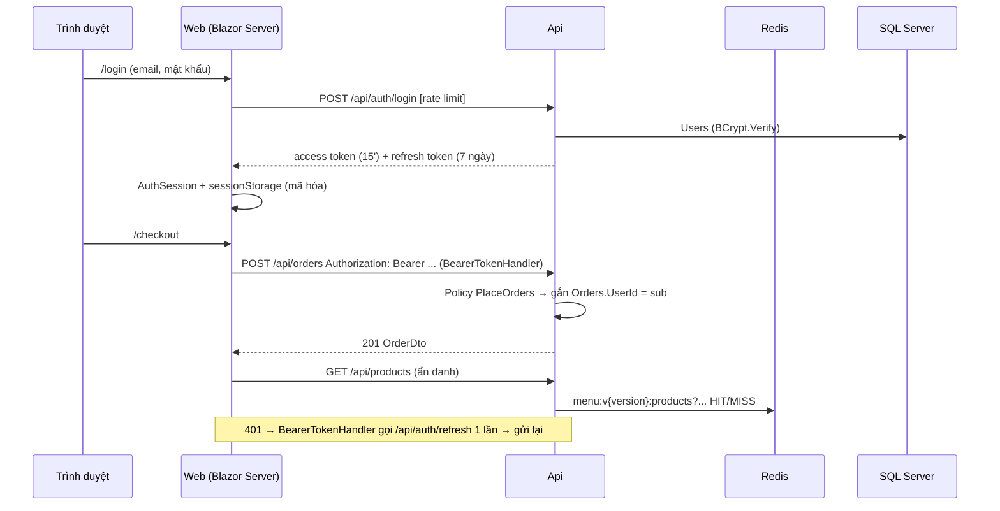

# Buổi 42–47 — Đăng nhập JWT, phân quyền, middleware, cache Redis, rate limiting

> **Thời lượng:** nhiều buổi (gợi ý chia bên dưới), mỗi buổi 120–150 phút
> **Tag xuất phát:** `b40-api-efcore`
> **Tag kết quả:** `b47-auth-cache`
> **Xem thay đổi:** `git diff b40-api-efcore b47-auth-cache --stat`

---

## Chuẩn bị trước giờ học

| Hạng mục | Chi tiết |
|----------|----------|
| Code | `git switch -c live-b42 b40-api-efcore` trên máy giảng viên |
| Lab đã dạy | `dotnet-webapi-lab` tag `b42` (middleware), `b43` (filter), `b44` (cache), `b45` (Repository/UoW), `b46` (JWT + BCrypt + refresh), `b47` (Blazor gọi API có token); `dotnet-blazor-lab` tag `b34` (AuthenticationStateProvider, hub có token) |
| Docker | `docker compose up -d` → SQL Server **và** Redis (cổng 6380); `docker compose ps` đều `healthy` |
| Database | `dotnet ef database update -p src/CyberCafe.Api` (thêm migration `AddUsersAndRefreshTokens`) |
| Tài khoản dev | `admin@cybercafe.local`, `barista@cybercafe.local`, `customer@cybercafe.local` — mật khẩu **giả** `Dev@12345` (chỉ seed khi `Seed:DevAccounts = true` ở Development) |
| Công cụ | jwt.io (đọc payload), `redis-cli` trong container: `docker exec -it cybercafe-redis-1 redis-cli` |
| Bản đích | Checkout `b47-auth-cache` ở thư mục khác để copy nhanh khi trễ giờ |

### Gợi ý chia buổi

| Buổi | Nội dung | Bước | Lab tương ứng |
|------|----------|------|---------------|
| 42 | Middleware: correlation id, request log, exception handler → ProblemDetails | 6–7 | webapi-lab `b42` |
| 43 | Filter: `[InvalidateMenuCache]` + đối chiếu các filter của lab | 9 | webapi-lab `b43` |
| 44 | Cache Redis cho thực đơn, key có phiên bản, Redis tắt vẫn chạy | 8 | webapi-lab `b44` |
| 45 | Bảng Users, BCrypt, ADR "DbContext trực tiếp" (thảo luận Repository/UoW) | 3, ADR | webapi-lab `b45`, `b46` |
| 46 | JWT, refresh token xoay vòng, policy, IDOR, rate limit | 1–5, 10–12 | webapi-lab `b46` |
| 47 | Web: đăng nhập, `AuthenticationStateProvider`, `DelegatingHandler`, hub có token; test + tag | 13–15 | webapi-lab `b47`, blazor-lab `b34` |

---

## Mục tiêu

Cuối chặng, học viên:

1. Phân biệt **authentication** (bạn là ai → 401) và **authorization** (bạn được làm gì → 403).
2. Lưu mật khẩu an toàn bằng **BCrypt** (salt + work factor), giải thích vì sao không dùng SHA-256.
3. Phát và kiểm tra **JWT**; dùng **refresh token xoay vòng** + phát hiện dùng lại.
4. Đặt quyền theo **policy** nghiệp vụ; chặn **IDOR** (xem/hủy đơn của người khác).
5. Viết middleware (correlation id, log) và dùng `IExceptionHandler` để mọi lỗi thành **ProblemDetails**.
6. Dùng filter đúng chỗ (gắn với action) và biết khi nào middleware hợp hơn.
7. Cache thực đơn bằng **Redis** với invalidation đúng; Redis lỗi thì API vẫn sống.
8. Chống dò mật khẩu bằng **rate limiting**.
9. Đăng nhập trong Blazor Server: `AuthenticationStateProvider` tự viết, `<AuthorizeView>`, `DelegatingHandler` gắn Bearer, SignalR với `access_token`.

---

## Tổng quan luồng



| Vai trò | Được làm |
|---------|----------|
| Ẩn danh | Xem thực đơn |
| Customer | Đặt đơn, xem `/my-orders`, xem/hủy (khi `Pending`) **đơn của mình** |
| Barista | Màn hình `/barista`, đổi trạng thái mọi đơn, vào group hub `baristas` |
| Admin | Mọi quyền Barista + `/admin/menu` (thêm/sửa/xóa món) + báo cáo doanh thu |

---

## Bước 1 — Cấu hình JWT kiểu "fail fast" (buổi 46, 15 phút)

`Program.cs`: `AddOptions<JwtOptions>().Bind(...).Validate(key ≥ 32 byte).ValidateOnStart()`.
Key **giả** chỉ nằm trong `appsettings.Development.json`; `appsettings.json` để trống → chạy Production mà quên đặt `Jwt__Key` thì app **không khởi động** (tốt hơn chạy với key rỗng).

`AddJwtBearer()` cấu hình trễ qua `AddOptions<JwtBearerOptions>().Configure<IOptions<JwtOptions>>(...)`: `MapInboundClaims = false`, `ClockSkew = 30s`, `NameClaimType = "name"`, `RoleClaimType = "role"`.

---

## Bước 2 — Phát token (buổi 46, 20 phút)

`TokenService.CreateAccessToken`: claims `sub`, `email`, `name`, `role`, `jti`; ký HMAC-SHA256. Refresh token = 64 byte ngẫu nhiên (`RandomNumberGenerator`), DB chỉ lưu **SHA-256** của nó.

### Demo nhanh
Đăng nhập trên Scalar → copy `accessToken` → dán vào jwt.io → thấy rõ `role: "Barista"`. Hỏi: *"Sửa role thành Admin rồi gửi lên được không?"* → Không: chữ ký sai → 401 (test `TamperedToken_Returns401`).

---

## Bước 3 — Users + BCrypt (buổi 45, 30 phút)

- `Auth/User.cs` (+ `RefreshToken`), `UserConfiguration` (unique index `Email`, `TokenHash`), shadow FK `Orders.UserId`.
- `dotnet ef migrations add AddUsersAndRefreshTokens -p src/CyberCafe.Api -o Data/Migrations`.
- `BCryptPasswordHasher`: work factor đọc từ `Auth:BCryptWorkFactor` (mặc định 11, test dùng 4).
- `AuthService.RegisterAsync`: role **luôn** `Customer` (client gửi `"role": "Admin"` cũng bị bỏ qua).
- `DevAccountSeeder`: tài khoản mẫu **không** nằm trong migration (HasData sẽ đưa tài khoản admin lên production).

### Giảng viên nói
> "SHA-256 băm 1 tỷ mật khẩu/giây trên GPU. BCrypt cố tình chậm và mỗi lần băm 1 salt mới — 2 người cùng mật khẩu `123456` vẫn ra 2 hash khác nhau."

---

## Bước 4 — Refresh token xoay vòng (buổi 46, 30 phút)

`AuthService.RefreshAsync`: tìm theo hash → đã thu hồi? → **thu hồi cả họ** (reuse detection) → hết hạn? → phát cặp mới, đánh dấu vé cũ `RevokedAt` + `ReplacedByTokenHash` trong **cùng** `SaveChanges`.

| Tình huống | Kết quả |
|-----------|---------|
| Refresh vé hợp lệ | 200, vé mới khác vé cũ |
| Dùng lại vé cũ | 401 **và** vé mới cũng bị thu hồi |
| Logout rồi refresh | 401 |

---

## Bước 5 — Policy theo nghiệp vụ (buổi 46, 20 phút)

`Auth/Policies.cs`: `ManageMenu` (Admin), `ProcessOrders` (Barista, Admin), `PlaceOrders` (Customer).

- `ProductsController`: `[Authorize(Policy = ManageMenu)]` ở **class**, mở `[AllowAnonymous]` cho 2 action GET ("đóng mặc định, mở có chủ đích").
- `OrdersController`: `[Authorize]` ở class; `Place`/`Mine` = `PlaceOrders`; `List`/`ChangeStatus` = `ProcessOrders`.
- `ReportsController`: `ManageMenu`.

---

## Bước 6 — Middleware: correlation id + request log (buổi 42, 30 phút)

```csharp
app.UseMiddleware<CorrelationIdMiddleware>();   // (1) ngoài cùng
app.UseMiddleware<RequestLoggingMiddleware>();  // (2) log cả request lỗi
app.UseExceptionHandler();                      // (3) DomainExceptionHandler / 500
app.UseStatusCodePages();                       // (4) 404 không body → ProblemDetails
app.UseAuthentication(); app.UseAuthorization();
app.UseRateLimiter();
```

- `X-Correlation-Id`: nhận từ client (đã lọc ký tự) hoặc tự tạo; trả lại trong response; `BeginScope` cho log.
- `RequestLoggingMiddleware` chỉ log `Path`, **không** log query string (hub gửi `?access_token=`!).
- `AddProblemDetails(o => o.CustomizeProblemDetails = ...)` gắn `correlationId` vào **mọi** ProblemDetails.

So với lab webapi `b42`: lab có `GlobalExceptionMiddleware` tự viết, `RequestTimingMiddleware`, `IpBlockingMiddleware`; ở đây giữ 2 middleware có ích cho vận hành và dùng `IExceptionHandler` có sẵn của .NET 8+.

---

## Bước 7 — Exception handler toàn cục (buổi 42, 25 phút)

`Errors/DomainExceptionHandler.cs` (`IExceptionHandler`):

| Exception | HTTP |
|-----------|------|
| `AuthenticationFailedException` | 401 |
| `ConflictException` (email trùng) | 409 |
| `ArgumentException` **ném từ Domain** | 400 |
| `InvalidOperationException` **ném từ Domain** | 409 |
| Còn lại | 500 (không lộ chi tiết) |

Nhờ đó `ProductsController`/`OrdersController` bỏ được các khối `try/catch` của b40 (so sánh `git diff b40-api-efcore b47-auth-cache -- src/CyberCafe.Api/Controllers`).

⚠️ Lỗi hay gặp: map **mọi** `InvalidOperationException` thành 409 → lỗi cấu hình EF Core (cũng là `InvalidOperationException`) bị che thành "vi phạm nghiệp vụ". Handler kiểm tra `exception.TargetSite` thuộc assembly Domain.

---

## Bước 8 — Redis cache cho thực đơn (buổi 44, 40 phút)

`Caching/MenuCache.cs` (cache-aside trên `IDistributedCache`):

- Key: `menu:v{version}:products?page=1&pageSize=20&sortBy=id&type=tea` (từ `ProductQuery.ToQueryString()`).
- **Invalidation bằng version**: ghi món → đổi `menu:version` → mọi key cũ thành "mồ côi", tự hết hạn sau TTL 5 phút. (Không xóa theo mẫu được với `IDistributedCache`.)
- Kết quả `null` không cache; header `X-Cache: HIT|MISS` để quan sát.
- Redis lỗi → log cảnh báo, đọc DB, **bỏ qua cache 30 giây** (khỏi request nào cũng chờ timeout).
- `Redis:Enabled = false` (test, máy không Docker) → `AddDistributedMemoryCache()` — cùng interface.

### Demo nhanh
1. `curl -i localhost:5180/api/products?type=tea` hai lần → `MISS` rồi `HIT`.
2. `docker exec cybercafe-redis-1 redis-cli --scan --pattern 'cybercafe:*'` → thấy key có version.
3. Admin sửa món → GET lại → `MISS`, dữ liệu mới.
4. `docker compose stop redis` → GET vẫn 200 (lần đầu chờ ~2 giây, sau đó tức thì) → `docker compose start redis`.

> `HybridCache` (.NET 9+) gộp L1 (RAM) + L2 (Redis) + chống "dồn request" khi MISS — giới thiệu như hướng nâng cấp, chưa dùng để giữ code dễ đọc.

---

## Bước 9 — Filter có giá trị thật (buổi 43, 25 phút)

`Filters/InvalidateMenuCacheAttribute.cs`: `TypeFilterAttribute` → `IAsyncActionFilter` chạy **sau** action, kết quả 2xx thì `MenuCache.InvalidateAsync()`. Gắn lên POST/PUT/DELETE món.

Đối chiếu các filter của lab webapi `b43`:

| Lab `b43` | CyberCafe `b47` | Vì sao |
|-----------|-----------------|--------|
| `ResourceCacheAttribute` | `MenuCache` (Redis) + `[InvalidateMenuCache]` | Cache phân tán, invalidation theo version |
| `ValidationFilter` | `[ApiController]` có sẵn + `CustomizeProblemDetails` | Không cần tự viết, vẫn có `correlationId` |
| `LogActionFilter` | `RequestLoggingMiddleware` | Log cả request không vào MVC (hub, 404) |
| `DomainExceptionFilter` | `DomainExceptionHandler` (`IExceptionHandler`) | Bắt được cả lỗi ngoài MVC |
| `ApiKeyAttribute` | JWT + policy | Phân quyền theo người dùng, không theo khóa chung |
| `ApiVersionHeaderFilter` | (không dùng) | Chưa có nhu cầu versioning |

### Check
*"Vì sao xóa cache bằng filter mà không bằng middleware?"* → Middleware không biết action nào ghi thực đơn; filter gắn đúng action.

---

## Bước 10 — Rate limiting đăng nhập (buổi 46, 15 phút)

`AddRateLimiter` + `RateLimitPartition.GetFixedWindowLimiter(ip, 5 lần / 1 phút)`; `[EnableRateLimiting("login")]` trên `login` và `register`; quá → **429** + `Retry-After: 60` (ProblemDetails).

⚠️ Sau reverse proxy mọi request có cùng IP của proxy → cần `UseForwardedHeaders` trước khi partition theo IP.

---

## Bước 11 — IDOR (buổi 46, 25 phút)

- `Place`: `db.Entry(order).Property("UserId").CurrentValue = User.GetUserId()` — chủ đơn lấy từ **token**, không từ body.
- `GET /api/orders/mine`: `Where(o => EF.Property<int?>(o, "UserId") == userId)`.
- `GET /api/orders/{id}`, `cancel`: khách không phải chủ → **404** (không tiết lộ đơn có tồn tại).
- Khách chỉ hủy khi `Pending`; nhân viên theo `OrderStatusFlow`.

### Demo nhanh
Đăng nhập 2 khách ở 2 tab, khách B gõ URL `/orders/{id của A}` → "Không tìm thấy đơn".

---

## Bước 12 — SignalR có token (buổi 46–47, 20 phút)

- Api: `[Authorize]` trên `OrderHub`; `JoinBaristas` có `[Authorize(Policy = ProcessOrders)]`; `WatchOrder` kiểm tra chủ đơn → `HubException`.
- `JwtBearerEvents.OnMessageReceived`: lấy `?access_token=` **chỉ** cho đường dẫn `/hubs/orders` (WebSocket không gửi được header).
- Web: `HubFactory.Create(() => Session.GetAccessTokenAsync())` — truyền **hàm**, không truyền chuỗi token → reconnect sau 20 phút vẫn có token còn hạn.

---

## Bước 13 — Đăng nhập trong Blazor Server (buổi 47, 40 phút)

- `App.razor`: **tắt prerender** (`InteractiveServerRenderMode(prerender: false)`) — token nằm trong sessionStorage, prerender chưa có trình duyệt để đọc.
- `AuthSession` (Scoped = theo circuit): giữ token, đồng bộ `ProtectedSessionStorage`, refresh trước hạn 30 giây, `SemaphoreSlim` để nhiều request cùng 401 chỉ refresh **1 lần**.
- `JwtAuthenticationStateProvider`: đọc payload JWT → `ClaimsPrincipal`; nghe `AuthSession.Changed` → `NotifyAuthenticationStateChanged`.
- `Routes.razor` → `AuthorizeRouteView` + `RedirectToLogin`; trang dùng `@attribute [Authorize(Roles = ...)]`; `NavMenu` dùng `<AuthorizeView Roles="...">`.
- `BlazorAuthorizationResultHandler` (giống blazor-lab `b34`): cho request HTTP tới trang Razor đi qua; kiểm tra thật trong circuit.
- Login chống **open redirect** (`returnUrl` chỉ nhận đường dẫn nội bộ).

---

## Bước 14 — `DelegatingHandler` gắn Bearer (buổi 47, 30 phút)

```csharp
builder.Services.AddTransient<BearerTokenHandler>();
builder.Services.AddHttpClient<OrderApiClient>(...).AddHttpMessageHandler<BearerTokenHandler>();
```

⚠️ Lỗi hay gặp: inject `AuthSession` vào constructor của handler → `IHttpClientFactory` tạo handler ở scope DI **riêng**, không phải scope của circuit → nhận `AuthSession` rỗng (lab webapi `b47` vì vậy gắn token ngay trong typed client).
Cách ở đây: typed client (tạo trong scope circuit) đính `AuthSession` vào `HttpRequestMessage.Options`; handler đọc ra → gắn token, gặp 401 thì refresh 1 lần rồi gửi lại. `AuthApiClient` **không** gắn handler (tránh vòng lặp refresh).

---

## Bước 15 — Test + tag (buổi 47, 30 phút)

| File | Kiểm tra |
|------|----------|
| `CyberCafe.Api.Tests/AuthTests.cs` | Login/sai mật khẩu (cùng thông báo), đăng ký luôn là Customer + hash BCrypt, email trùng 409, mật khẩu yếu 400, refresh rotation + reuse detection, logout, `/me`, token bị sửa → 401, rate limit 429, BCrypt có salt |
| `CyberCafe.Api.Tests/AuthorizationTests.cs` | Bảng 401/403 theo vai trò, IDOR (đọc/hủy/mine), khách chỉ hủy khi Pending, hub: không token / sai role / IDOR |
| `CyberCafe.Api.Tests/MiddlewareAndCacheTests.cs` | Correlation id, ProblemDetails có `correlationId`, handler chỉ map exception của Domain, cache HIT/MISS + invalidation, Redis hỏng vẫn trả dữ liệu |
| `CyberCafe.Tests/Web/AuthClientTests.cs` | Handler gắn Bearer, 401 → refresh → gửi lại, refresh bị từ chối → đăng xuất, refresh đồng thời chỉ 1 lần, refresh trước hạn, provider đọc role/name |

```bash
dotnet test        # 137 test xanh, không cần Docker/Redis
git add -A
git commit -m "b47: JWT auth with refresh rotation, role policies, middleware, Redis cache and rate limiting"
git tag -a b47-auth-cache -m "Buổi 42–47: JWT + BCrypt + refresh token, phân quyền, middleware, Redis cache, rate limiting"
```

Test tích hợp đặt cấu hình riêng trong `CyberCafeApiFactory`: khóa JWT giả, seed tài khoản dev với mật khẩu test, BCrypt work factor 4, rate limit cao (trừ test rate limit), cache trong RAM.

---

## Lab cho học viên

1. **Đổi mật khẩu**: `POST /api/auth/change-password` (cần đăng nhập, kiểm tra mật khẩu cũ bằng BCrypt, thu hồi mọi refresh token cũ). Viết test.
2. **Trang báo cáo cho Admin** `/admin/revenue` dùng `GET /api/reports/daily-revenue` (403 với Barista).
3. **Cache chi tiết đơn cho barista?** Thảo luận: dữ liệu đổi liên tục → có nên cache không? Viết 3–5 câu kết luận.
4. (Nâng cao) Thay `MenuCache` bằng `HybridCache`, so sánh số dòng code và hành vi khi Redis tắt.

---

## Exit ticket

1. 401 và 403 khác nhau thế nào? Cho 1 ví dụ mỗi loại trong CyberCafe.
2. Vì sao lưu mật khẩu bằng BCrypt mà refresh token chỉ cần SHA-256?
3. Kẻ trộm lấy được refresh token cũ và dùng sau khi chủ thật đã refresh — Api phản ứng thế nào?
4. IDOR là gì? CyberCafe chặn ở những chỗ nào (REST và hub)?
5. Vì sao không xóa từng key cache khi admin sửa món?
6. Vì sao `DelegatingHandler` không inject thẳng `AuthSession` trong Blazor Server?

**Đáp án gợi ý:** (1) 401: chưa đăng nhập gọi POST món; 403: khách gọi PUT trạng thái. (2) Mật khẩu ngắn, đoán được → cần băm chậm có salt; refresh token là 512 bit ngẫu nhiên, không dò được. (3) Vé cũ đã bị thu hồi → 401 và thu hồi toàn bộ vé của user. (4) Truy cập tài nguyên của người khác bằng cách đổi Id; chặn ở `GetById`, `cancel`, `mine` (lọc theo token) và `WatchOrder`. (5) Vô số biến thể query → đổi version 1 lần làm vô hiệu tất cả. (6) Handler sống ở scope của `IHttpClientFactory`, không phải scope circuit → nhận nhầm instance.

---

## Câu hỏi thường gặp

| Câu hỏi | Trả lời |
|---------|---------|
| Đăng nhập báo 429 khi đang dạy? | Rate limit 5 lần/phút/IP — cả lớp chung 1 IP NAT sẽ chạm nhanh. Tăng `RateLimiting:LoginPermitLimit` trong `appsettings.Development.json` khi demo. |
| Restart Web xong bị đăng xuất? | Khóa Data Protection đổi → sessionStorage cũ không giải mã được → đăng nhập lại (bình thường ở dev). |
| Restart Api xong Web vẫn đăng nhập? | Có: JWT không lưu phiên phía server; key không đổi thì token cũ vẫn hợp lệ tới khi hết hạn. |
| Sao không thấy tài khoản dev trong migration? | Cố ý: chỉ seed ở Development (`Seed:DevAccounts`). |
| Không có Docker/Redis? | Đặt `Redis:Enabled = false` → dùng cache trong RAM, mọi thứ khác giữ nguyên. |
| Sao không dùng Repository + UoW như lab b45? | Xem [ADR 0001](../adr/0001-dbcontext-truc-tiep.md). |

---

## Checklist giảng viên cuối chặng

- [ ] Demo 3 vai trò ở 3 tab (khách, barista, admin): menu điều hướng khác nhau, trang bị chặn đúng
- [ ] Demo IDOR bị chặn (đổi URL đơn hàng)
- [ ] Demo `X-Cache` HIT/MISS và tắt Redis vẫn chạy
- [ ] Demo refresh token reuse → bị thu hồi cả họ
- [ ] ≥ 70% hoàn thành lab 1 + 2
- [ ] `dotnet test` xanh; học viên checkout được `b47-auth-cache`
- [ ] Preview buổi 48: "Controller đang biết EF Core, BCrypt, Redis… — tách tầng thế nào để đổi hạ tầng không sửa nghiệp vụ?"
